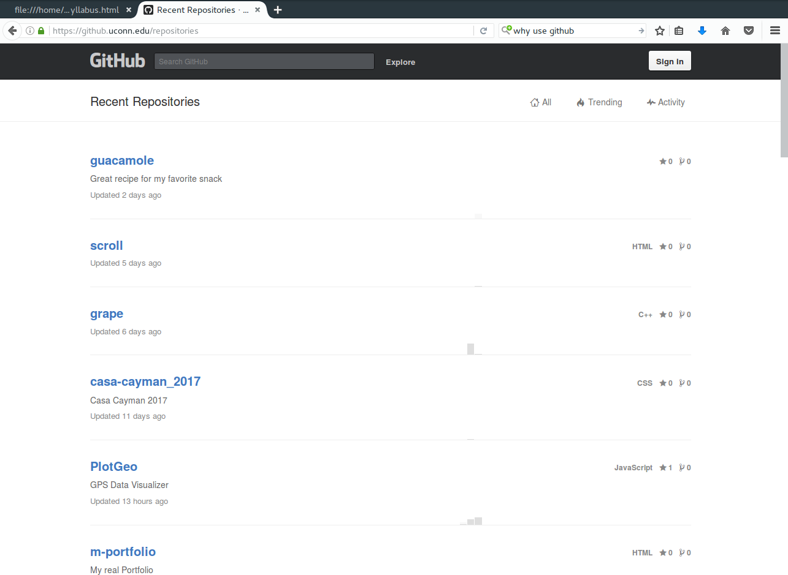
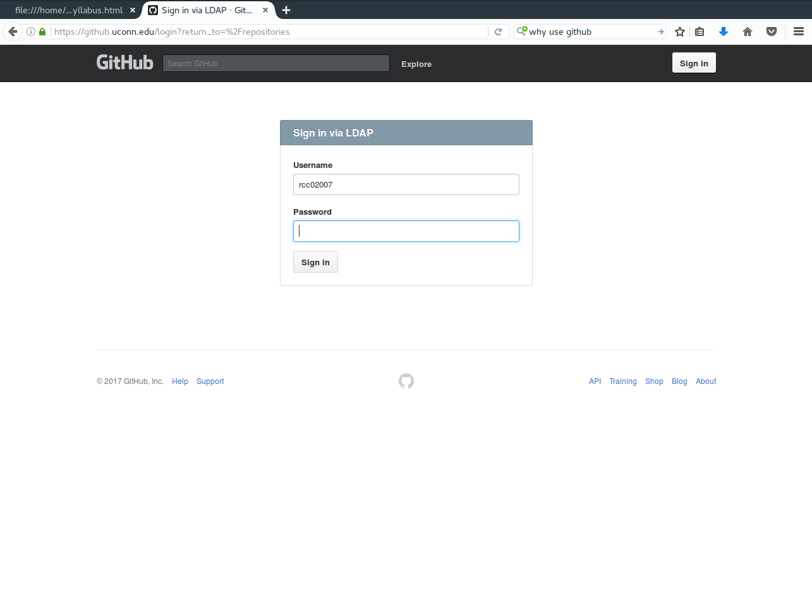
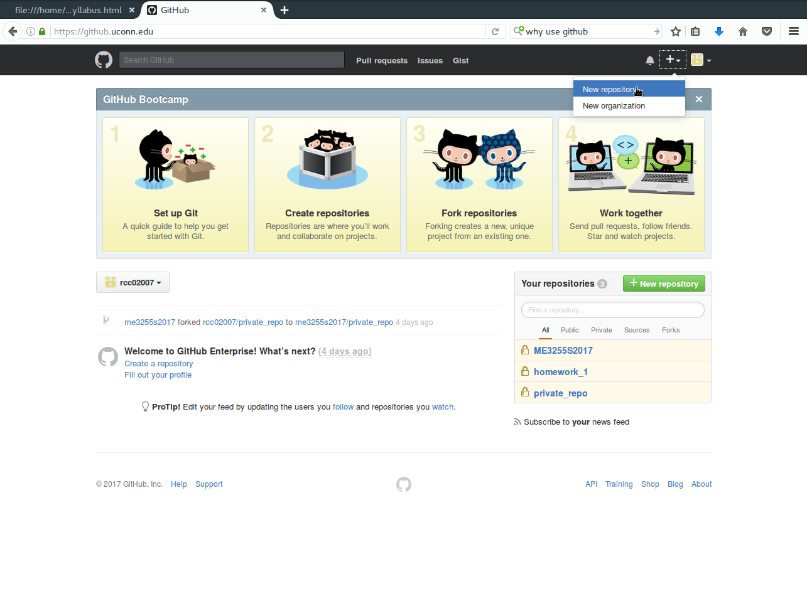
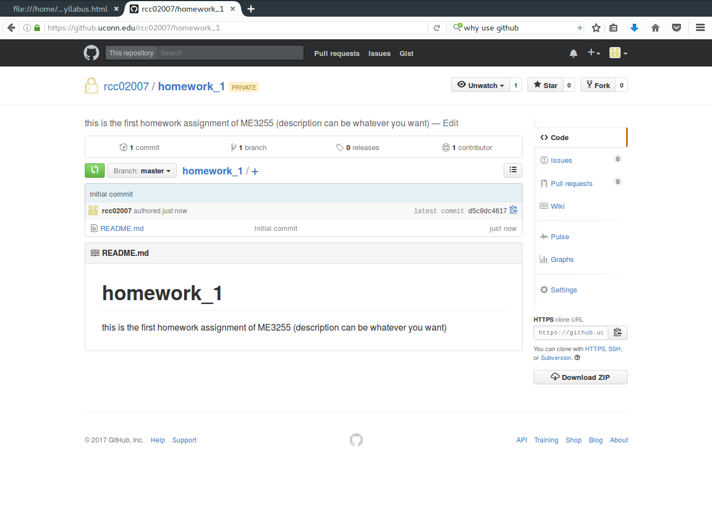
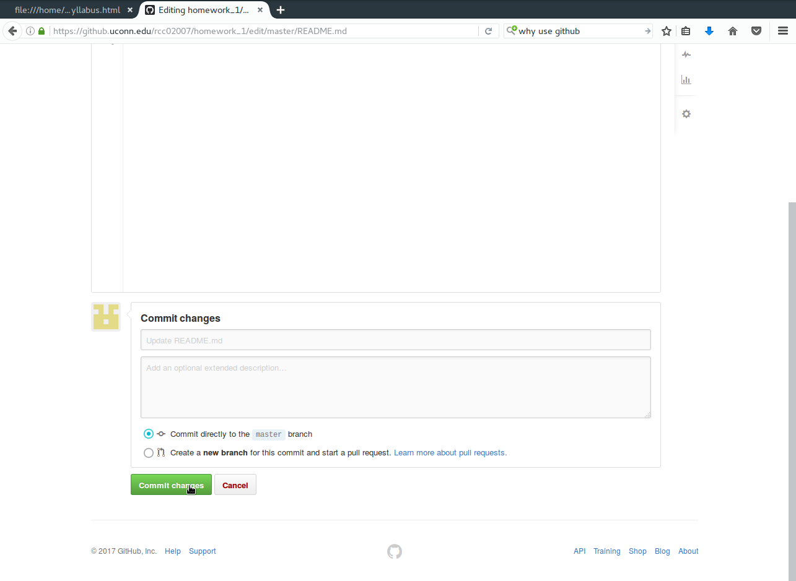

# Homework #1

1. The first assignment is to fork the course syllabus and assignment. 

    a. Sign into your UConn github account via
    [github.uconn.edu](https://github.uconn.edu/). 

    b. Go to
    [https://github.uconn.edu/rcc02007/ME3255S2017.git](https://github.uconn.edu/rcc02007/ME3255S2017.git)
    and watch the repository. 

    c. Fork the repository to create your own version of the syllabus and assignments. 

2. The next assignment is to create your own repository named homework_1.
    
    a. (if you signed out) Sign into your UConn github account via
    [github.uconn.edu](https://github.uconn.edu/). 

    b. Follow these steps to create your own repository named `homework_1`:

    

    

    

    

    

    

    

    

