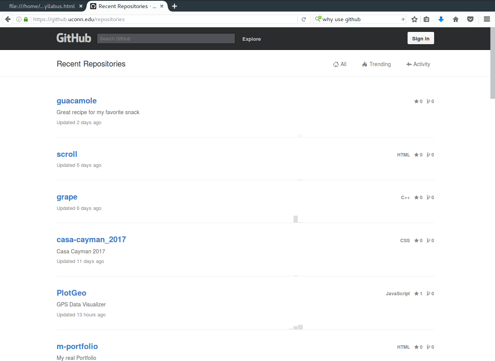
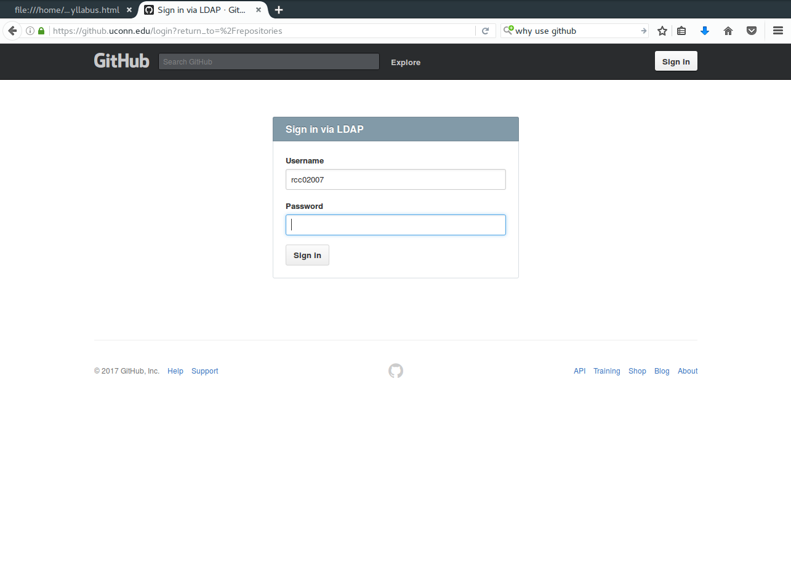
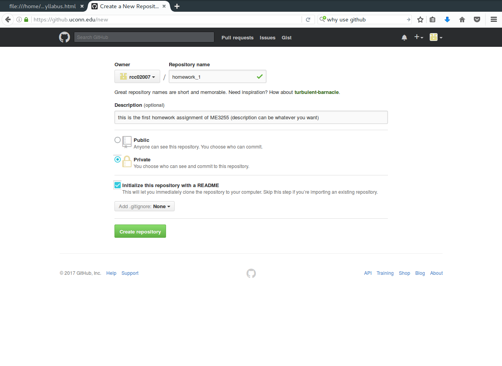
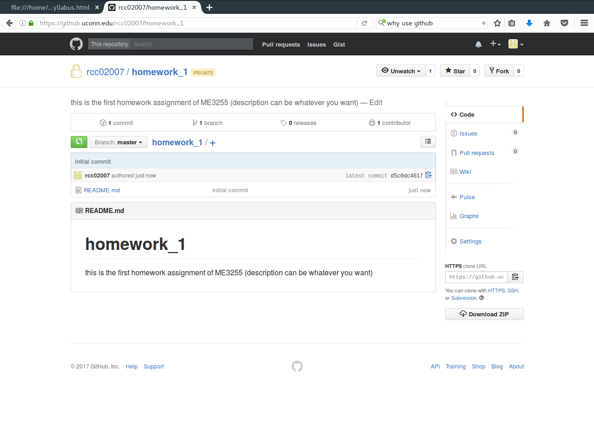
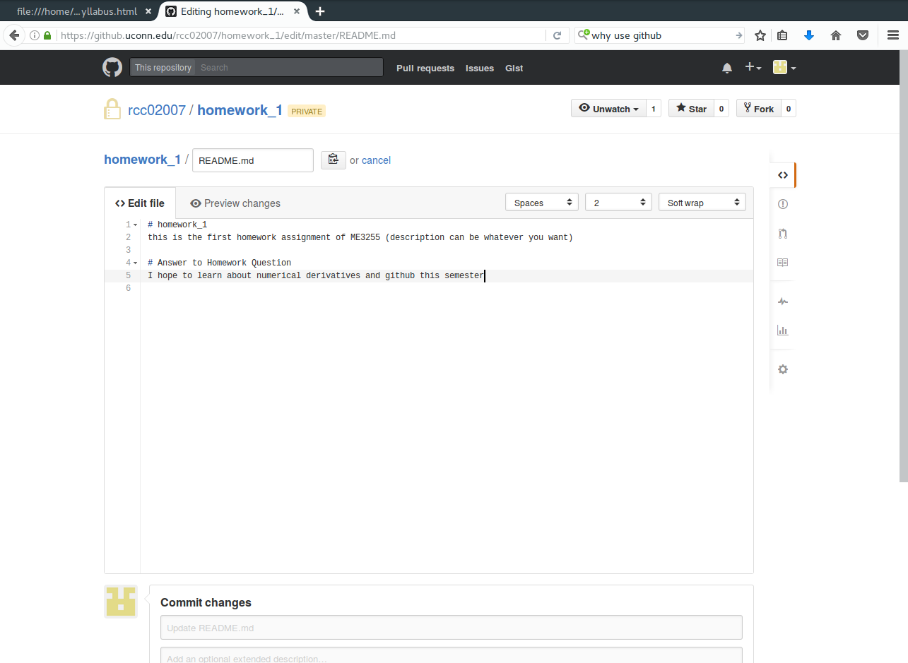
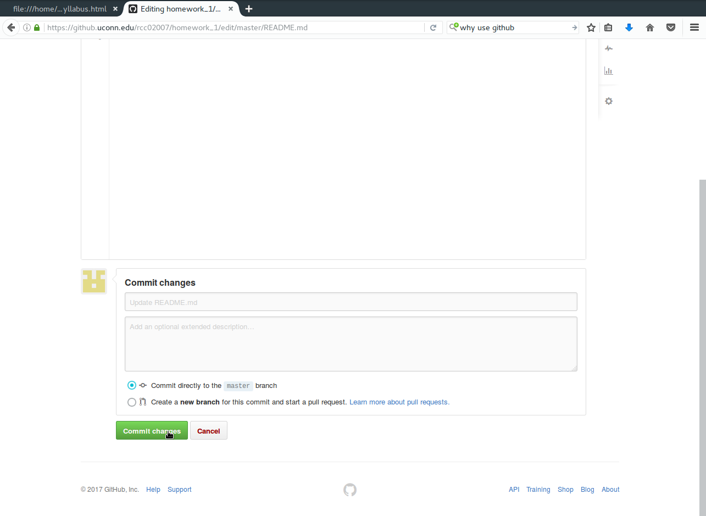
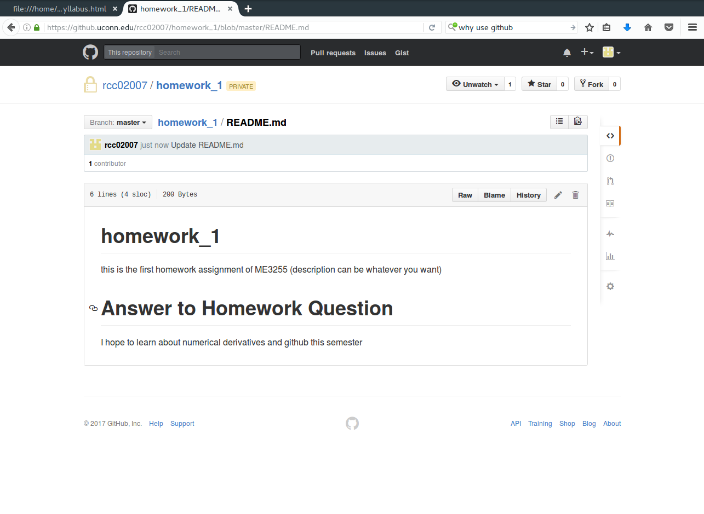

# Homework #1
## due 1/24/17

1. The first assignment is to fork the course syllabus and assignment. 

    a. Sign into your UConn github account via
    [github.uconn.edu](https://github.uconn.edu/). 

    b. Go to
    [https://github.uconn.edu/rcc02007/ME3255S2017.git](https://github.uconn.edu/rcc02007/ME3255S2017.git)
    and watch the repository. 

    c. Fork the repository to create your own version of the syllabus and assignments. 

2. The next assignment is to create your own repository named homework_1.
    
    a. (if you signed out) Sign into your UConn github account via
    [github.uconn.edu](https://github.uconn.edu/). 

    b. Follow these steps to create your own repository named `homework_1`:

        i. Click the +-sign and choose 'New repository'
        

        ii. In the 'Repository name' enter 'homework_1'. Add a description. Make it
        private. Then check the box 'Initialize this repository with a README'. 

        iii. Now you are in your repo. Click on the README.md file and then click the
        pencil to edit it. 

        iv. Add a header with a `#` and type `# Answer to Homework Question`. Under this
        line answer this question: What do you hope to learn this semester?

        v. At bottom of page, click 'Commit changes'.

        vi. Verify that your README.md file has been updated. Then copy the HTTPS clone
        URL on the right of the page. 

        vii. Paste this into the Homework #1 Google form reponse. 

