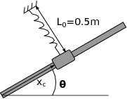

# Homework #4
## due 3/1/17 by 11:59pm

1. Use your repository 'roots_and_optimization'. Document all the HW4 work under the
heading `# Homework #4` in your `README.md` file

    a. Create a function called 'collar_potential_energy' that computes the total
    potential energy of a collar connected to a spring and sliding on a rod. As shown in
    the figure given a position, xc, and angle, theta:

    

    The spring is unstretched when x_C=0.5 m. The potential energy due to gravity is:

    PE_g=m x_C\*g\*sin(theta)

    where m=0.5 kg, and g is the acceleration due to gravity, 

    and the potential energy due to the spring is:

    PE_s=1/2\*K \*(DL)^2

    where DL = 0.5 - sqrt(0.5^2+(0.5-x_C)^2) and K=30 N/m.

    b. Use the `goldmin.m` function to solve for the minimum potential energy at xc when
    theta=0. *create an anonymous function with `@(x) collar_potential_energy(x,theta)` in
    the input for goldmin. Be sure to include the script that solves for xc*

    c. Create a for-loop that solves for the minimum potential energy position, xc, at a
    given angle, theta, for theta = 0..90 degrees. 

    d. Include a plot of xc vs theta. `plot(theta,xc)` with

    ``
    
3. Commit your changes to your repository. Sync your local repository with github.
