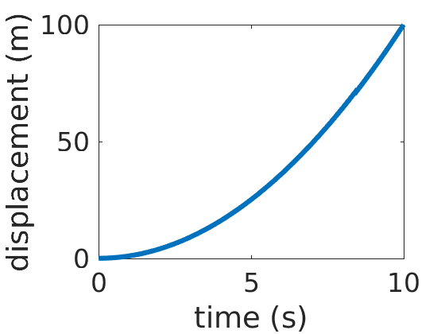
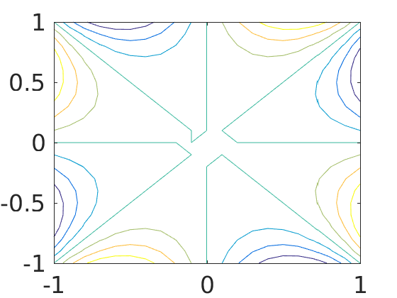
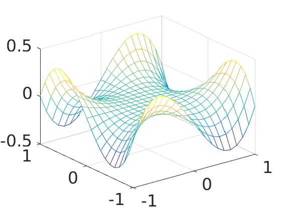
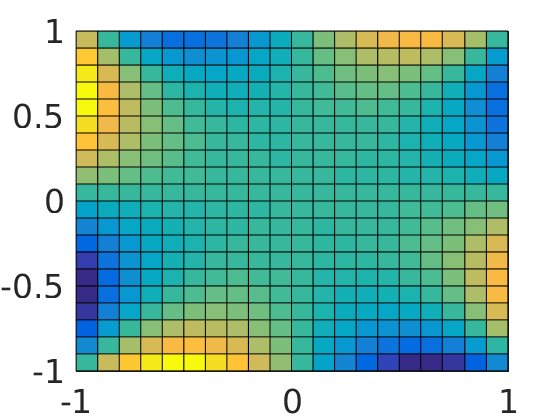
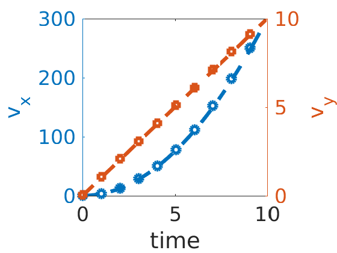
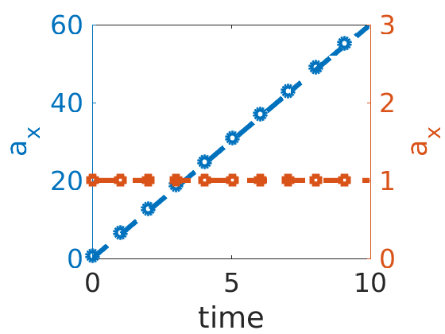

```matlab
## When using the command prompt, anything in your path or working directory can be run either as a script, function or class (to define objects)
```

    Error: The input character is not valid in MATLAB statements or expressions.
    


```matlab
%myscript
```


```matlab
%plot --format svg
```

When using the GUI, your command history is saved, but it is better to save your work either as a script or a function or combination of both

Creating a default graph script: `setdefaults.m`

```matlab
set(0, 'defaultAxesFontSize', 16)
set(0,'defaultTextFontSize',14)
set(0,'defaultLineLineWidth',3)
```


```matlab
set(0, 'defaultAxesFontSize', 16)
set(0,'defaultTextFontSize',14)
set(0,'defaultLineLineWidth',3)
```


```matlab
t_linear=linspace(0,10,100);
plot(t_linear,t_linear.^2)
xlabel('time (s)')
ylabel('displacement (m)')
```





#EOL

## Graphics can be produced with a number of functions

2-D plots, 3-D plots, contour plots, 3D contour plots ... 


```matlab
x=linspace(-1,1,21); y=linspace(-1,1,21);
[X,Y]=meshgrid(x,y);
Z=(X.*Y.^3-X.^3.*Y)
```

    Z =
    
      Columns 1 through 7
    
             0    0.1710    0.2880    0.3570    0.3840    0.3750    0.3360
       -0.1710         0    0.1224    0.2016    0.2430    0.2520    0.2340
       -0.2880   -0.1224         0    0.0840    0.1344    0.1560    0.1536
       -0.3570   -0.2016   -0.0840         0    0.0546    0.0840    0.0924
       -0.3840   -0.2430   -0.1344   -0.0546         0    0.0330    0.0480
       -0.3750   -0.2520   -0.1560   -0.0840   -0.0330         0    0.0180
       -0.3360   -0.2340   -0.1536   -0.0924   -0.0480   -0.0180         0
       -0.2730   -0.1944   -0.1320   -0.0840   -0.0486   -0.0240   -0.0084
       -0.1920   -0.1386   -0.0960   -0.0630   -0.0384   -0.0210   -0.0096
       -0.0990   -0.0720   -0.0504   -0.0336   -0.0210   -0.0120   -0.0060
             0         0         0         0         0         0         0
        0.0990    0.0720    0.0504    0.0336    0.0210    0.0120    0.0060
        0.1920    0.1386    0.0960    0.0630    0.0384    0.0210    0.0096
        0.2730    0.1944    0.1320    0.0840    0.0486    0.0240    0.0084
        0.3360    0.2340    0.1536    0.0924    0.0480    0.0180    0.0000
        0.3750    0.2520    0.1560    0.0840    0.0330         0   -0.0180
        0.3840    0.2430    0.1344    0.0546   -0.0000   -0.0330   -0.0480
        0.3570    0.2016    0.0840         0   -0.0546   -0.0840   -0.0924
        0.2880    0.1224         0   -0.0840   -0.1344   -0.1560   -0.1536
        0.1710    0.0000   -0.1224   -0.2016   -0.2430   -0.2520   -0.2340
             0   -0.1710   -0.2880   -0.3570   -0.3840   -0.3750   -0.3360
    
      Columns 8 through 14
    
        0.2730    0.1920    0.0990         0   -0.0990   -0.1920   -0.2730
        0.1944    0.1386    0.0720         0   -0.0720   -0.1386   -0.1944
        0.1320    0.0960    0.0504         0   -0.0504   -0.0960   -0.1320
        0.0840    0.0630    0.0336         0   -0.0336   -0.0630   -0.0840
        0.0486    0.0384    0.0210         0   -0.0210   -0.0384   -0.0486
        0.0240    0.0210    0.0120         0   -0.0120   -0.0210   -0.0240
        0.0084    0.0096    0.0060         0   -0.0060   -0.0096   -0.0084
             0    0.0030    0.0024         0   -0.0024   -0.0030         0
       -0.0030         0    0.0006         0   -0.0006         0    0.0030
       -0.0024   -0.0006         0         0    0.0000    0.0006    0.0024
             0         0         0         0         0         0         0
        0.0024    0.0006   -0.0000         0         0   -0.0006   -0.0024
        0.0030         0   -0.0006         0    0.0006         0   -0.0030
             0   -0.0030   -0.0024         0    0.0024    0.0030         0
       -0.0084   -0.0096   -0.0060         0    0.0060    0.0096    0.0084
       -0.0240   -0.0210   -0.0120         0    0.0120    0.0210    0.0240
       -0.0486   -0.0384   -0.0210         0    0.0210    0.0384    0.0486
       -0.0840   -0.0630   -0.0336         0    0.0336    0.0630    0.0840
       -0.1320   -0.0960   -0.0504         0    0.0504    0.0960    0.1320
       -0.1944   -0.1386   -0.0720         0    0.0720    0.1386    0.1944
       -0.2730   -0.1920   -0.0990         0    0.0990    0.1920    0.2730
    
      Columns 15 through 21
    
       -0.3360   -0.3750   -0.3840   -0.3570   -0.2880   -0.1710         0
       -0.2340   -0.2520   -0.2430   -0.2016   -0.1224   -0.0000    0.1710
       -0.1536   -0.1560   -0.1344   -0.0840         0    0.1224    0.2880
       -0.0924   -0.0840   -0.0546         0    0.0840    0.2016    0.3570
       -0.0480   -0.0330    0.0000    0.0546    0.1344    0.2430    0.3840
       -0.0180         0    0.0330    0.0840    0.1560    0.2520    0.3750
       -0.0000    0.0180    0.0480    0.0924    0.1536    0.2340    0.3360
        0.0084    0.0240    0.0486    0.0840    0.1320    0.1944    0.2730
        0.0096    0.0210    0.0384    0.0630    0.0960    0.1386    0.1920
        0.0060    0.0120    0.0210    0.0336    0.0504    0.0720    0.0990
             0         0         0         0         0         0         0
       -0.0060   -0.0120   -0.0210   -0.0336   -0.0504   -0.0720   -0.0990
       -0.0096   -0.0210   -0.0384   -0.0630   -0.0960   -0.1386   -0.1920
       -0.0084   -0.0240   -0.0486   -0.0840   -0.1320   -0.1944   -0.2730
             0   -0.0180   -0.0480   -0.0924   -0.1536   -0.2340   -0.3360
        0.0180         0   -0.0330   -0.0840   -0.1560   -0.2520   -0.3750
        0.0480    0.0330         0   -0.0546   -0.1344   -0.2430   -0.3840
        0.0924    0.0840    0.0546         0   -0.0840   -0.2016   -0.3570
        0.1536    0.1560    0.1344    0.0840         0   -0.1224   -0.2880
        0.2340    0.2520    0.2430    0.2016    0.1224         0   -0.1710
        0.3360    0.3750    0.3840    0.3570    0.2880    0.1710         0


```matlab
contour(X,Y,Z)
```





```matlab
mesh(X,Y,Z)
```





```matlab
pcolor(X,Y,Z)
```





## Functions

So far, everything has been executed as a script, or calling a built-in function. Now we begin building our own functions.

Functions are saved in memory (or better yet) in a folder in your path or current directory

Example of storing function in memory

$f(x,y) = (xy^{3}-x^{3}y)$


```matlab
f= @(x,y) (x.*y.^3-x.^3.*y)
```

    f = 
    
        @(x,y)(x.*y.^3-x.^3.*y)


```matlab
f(0.1,-0.5)
```

    ans =
    
       -0.0120


Here we will save a function called `my_function` as `my_function.m`

```matlab 
function [vx,vy] = my_function(x,y,t)
    % Help documentation of "my_function"
    % This function computes the velocity in the x- and y-directions given
    % three vectors of position in x- and y-directions as a function of time
    % x = x-position
    % y = y-position
    % t = time
    % output
    % vx = velocity in x-direction
    % vy = velocity in y-direction
    
    vx=zeros(length(t),1);
    vy=zeros(length(t),1);
    
    vx(1:end-1) = diff(x)./diff(t); % calculate vx as delta x/delta t
    vy(1:end-1) = diff(y)./diff(t); % calculate vy as delta y/delta t
    
    vx(end) = vx(end-1);
    vy(end) = vy(end-1);

end
```


```matlab
help my_function
```

    Help documentation of "my_function"
      This function computes the velocity in the x- and y-directions given
      three vectors of position in x- and y-directions as a function of time
      x = x-position
      y = y-position
      t = time
      output
      vx = velocity in x-direction
      vy = velocity in y-direction


```matlab
t=linspace(0,10,100)'; 
x=t.^3; % vx = 3*t^2
y=t.^2/2;  % vy = t
[vx,vy]=my_function(x,y,t);
```


```matlab
yyaxis left
plot(t(1:10:end),vx(1:10:end),'o',t,3*t.^2)
ylabel('v_{x}')
yyaxis right
plot(t(1:10:end),vy(1:10:end),'s',t, t)
ylabel('v_{y}')
xlabel('time')
```





Now, create a new function that calls 'my_function' called, `my_caller.m`


```matlab
help my_caller
```

    Help documentation of "my_caller"
      This function computes the acceleration in the x- and y-directions given
      three vectors of position in x- and y-directions as a function of time
      x = x-position
      y = y-position
      t = time
      output
      ax = velocity in x-direction
      ay = velocity in y-direction


```matlab
[ax,ay]=my_caller(x,y,t);
```


```matlab
yyaxis left
plot(t(1:10:end),ax(1:10:end),'o',t,6*t)
ylabel('a_{x}')
yyaxis right
plot(t(1:10:end),ay(1:10:end),'s',t, 1*t./t)
ylabel('a_{x}')
xlabel('time')
axis([0,10,0,3])
```





```matlab
diff_match_dims(x,t)
```

    Undefined function 'diff_match_dims' for input arguments of type 'double'.
    


```matlab

```
