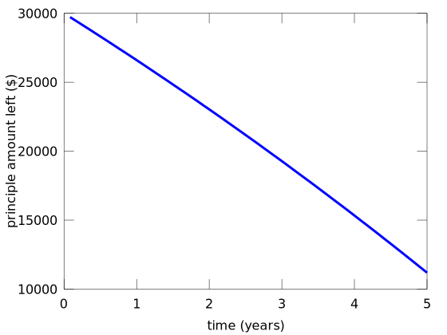
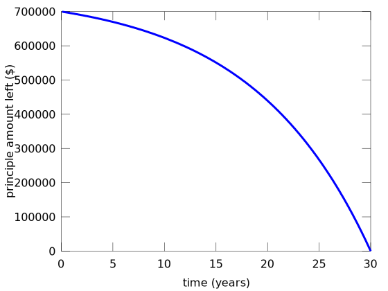
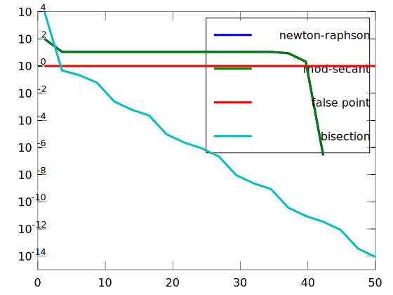

```octave
%plot --format svg
```


```octave
setdefaults
```

# Roots: Open methods
## Newton-Raphson

First-order approximation for the location of the root (i.e. assume the slope at the given point is constant, what is the solution when f(x)=0)

$f'(x_{i})=\frac{f(x_{i})-0}{x_{i}-x_{i+1}}$

$x_{i+1}=x_{i}-\frac{f(x_{i})}{f'(x_{i})}$

Use Newton-Raphson to find solution when $e^{-x}=x$


```octave
f= @(x) exp(-x)-x;
df= @(x) -exp(-x)-1;

x_i= 0;
x_r = x_i-f(x_i)/df(x_i)
error_approx = abs((x_r-x_i)/x_r)
x_i=x_r;

```

    x_r =  0.50000
    error_approx =  1


```octave
x_r = x_i-f(x_i)/df(x_i)
error_approx = abs((x_r-x_i)/x_r)
x_i=x_r;
```

    x_r =  0.56631
    error_approx =  0.11709


```octave
x_r = x_i-f(x_i)/df(x_i)
error_approx = abs((x_r-x_i)/x_r)
x_i=x_r;
```

    x_r =  0.56714
    error_approx =  0.0014673


```octave
x_r = x_i-f(x_i)/df(x_i)
error_approx = abs((x_r-x_i)/x_r)
x_i=x_r;
```

    x_r =  0.56714
    error_approx =    2.2106e-07


In the bungee jumper example, we created a function f(m) that when f(m)=0, then the mass had been chosen such that at t=4 s, the velocity is 36 m/s. 

$f(m)=\sqrt{\frac{gm}{c_{d}}}\tanh(\sqrt{\frac{gc_{d}}{m}}t)-v(t)$.

to use the Newton-Raphson method, we need the derivative $\frac{df}{dm}$

$\frac{df}{dm}=\frac{1}{2}\sqrt{\frac{g}{mc_{d}}}\tanh(\sqrt{\frac{gc_{d}}{m}}t)-
\frac{g}{2m}\mathrm{sech}^{2}(\sqrt{\frac{gc_{d}}{m}}t)$


```octave
setdefaults
g=9.81; % acceleration due to gravity
m=linspace(50, 200,100); % possible values for mass 50 to 200 kg
c_d=0.25; % drag coefficient
t=4; % at time = 4 seconds
v=36; % speed must be 36 m/s
f_m = @(m) sqrt(g*m/c_d).*tanh(sqrt(g*c_d./m)*t)-v; % anonymous function f_m
df_m = @(m) 1/2*sqrt(g./m/c_d).*tanh(sqrt(g*c_d./m)*t)-g/2./m*sech(sqrt(g*c_d./m)*t).^2;
```


```octave
[root,ea,iter]=newtraph(f_m,df_m,140,0.00001)
```

    root =  142.74
    ea =    8.0930e-06
    iter =  48


## Secant Methods

Not always able to evaluate the derivative. Approximation of derivative:

$f'(x_{i})=\frac{f(x_{i-1})-f(x_{i})}{x_{i-1}-x_{i}}$

$x_{i+1}=x_{i}-\frac{f(x_{i})}{f'(x_{i})}$

$x_{i+1}=x_{i}-\frac{f(x_{i})}{\frac{f(x_{i-1})-f(x_{i})}{x_{i-1}-x_{i}}}=
    x_{i}-\frac{f(x_{i})(x_{i-1}-x_{i})}{f(x_{i-1})-f(x_{i})}$
    
What values should $x_{i}$ and $x_{i-1}$ take?

To reduce arbitrary selection of variables, use the

## Modified Secant method

Change the x evaluations to a perturbation $\delta$. 

$x_{i+1}=x_{i}-\frac{f(x_{i})(\delta x_{i})}{f(x_{i}+\delta x_{i})-f(x_{i})}$


```octave
[root,ea,iter]=mod_secant(f_m,1,50,0.00001)
```

    root =  142.74
    ea =    3.0615e-07
    iter =  7


```octave
car_payments(400,30000,0.05,5,1)
```

    ans =    1.1185e+04





```octave
Amt_numerical=mod_secant(@(A) car_payments(A,700000,0.0875,30,0),1e-6,50,0.001)
car_payments(Amt_numerical,700000,0.0875,30,1)
```

    Amt_numerical =  5467.0
    ans =    3.9755e-04





```octave
Amt_numerical*12*30
```

    ans =    1.9681e+06


Amortization calculation makes the same calculation for the monthly payment amount, A, paying off the principle amount, P, over n pay periods with monthly interest rate, r. 


```octave
% Amortization calculation
A  = @(P,r,n) P*(r*(1+r)^n)./((1+r)^n-1);
Amt=A(30000,0.05/12,5*12)
```

    Amt =  566.14


## Matlab's function

Matlab and Octave combine bracketing and open methods in the `fzero` function. 


```octave
help fzero
```

    'fzero' is a function from the file /usr/share/octave/4.0.0/m/optimization/fzero.m
    
     -- Function File: fzero (FUN, X0)
     -- Function File: fzero (FUN, X0, OPTIONS)
     -- Function File: [X, FVAL, INFO, OUTPUT] = fzero (...)
         Find a zero of a univariate function.
    
         FUN is a function handle, inline function, or string containing the
         name of the function to evaluate.
    
         X0 should be a two-element vector specifying two points which
         bracket a zero.  In other words, there must be a change in sign of
         the function between X0(1) and X0(2).  More mathematically, the
         following must hold
    
              sign (FUN(X0(1))) * sign (FUN(X0(2))) <= 0
    
         If X0 is a single scalar then several nearby and distant values are
         probed in an attempt to obtain a valid bracketing.  If this is not
         successful, the function fails.
    
         OPTIONS is a structure specifying additional options.  Currently,
         'fzero' recognizes these options: "FunValCheck", "OutputFcn",
         "TolX", "MaxIter", "MaxFunEvals".  For a description of these
         options, see *note optimset: XREFoptimset.
    
         On exit, the function returns X, the approximate zero point and
         FVAL, the function value thereof.
    
         INFO is an exit flag that can have these values:
    
            * 1 The algorithm converged to a solution.
    
            * 0 Maximum number of iterations or function evaluations has
              been reached.
    
            * -1 The algorithm has been terminated from user output
              function.
    
            * -5 The algorithm may have converged to a singular point.
    
         OUTPUT is a structure containing runtime information about the
         'fzero' algorithm.  Fields in the structure are:
    
            * iterations Number of iterations through loop.
    
            * nfev Number of function evaluations.
    
            * bracketx A two-element vector with the final bracketing of the
              zero along the x-axis.
    
            * brackety A two-element vector with the final bracketing of the
              zero along the y-axis.
    
         See also: optimset, fsolve.
    
    Additional help for built-in functions and operators is
    available in the online version of the manual.  Use the command
    'doc <topic>' to search the manual index.
    
    Help and information about Octave is also available on the WWW
    at http://www.octave.org and via the help@octave.org
    mailing list.


```octave
fzero(@(A) car_payments(A,30000,0.05,5,0),500)
```

    ans =  563.79


## Comparison of Solvers

It's helpful to compare to the convergence of different routines to see how quickly you find a solution. 

Comparing the freefall example


```octave
N=20;
iterations = linspace(1,400,N);
ea_nr=zeros(1,N); % appr error Newton-Raphson
ea_ms=zeros(1,N); % appr error Modified Secant
ea_fp=zeros(1,N); % appr error false point method
ea_bs=zeros(1,N); % appr error bisect method
for i=1:length(iterations)
    [root_nr,ea_nr(i),iter_nr]=newtraph(f_m,df_m,300,0,iterations(i));
    [root_ms,ea_ms(i),iter_ms]=mod_secant(f_m,1e-6,300,0,iterations(i));
    [root_fp,ea_fp(i),iter_fp]=falsepos(f_m,1,300,0,iterations(i));
    [root_bs,ea_bs(i),iter_bs]=bisect(f_m,1,300,0,iterations(i));
end

setdefaults
semilogy(iterations,abs(ea_nr),iterations,abs(ea_ms),iterations,abs(ea_fp),iterations,abs(ea_bs))
legend('newton-raphson','mod-secant','false point','bisection')
```

    warning: axis: omitting non-positive data in log plot
    warning: called from
        __line__ at line 120 column 16
        line at line 56 column 8
        __plt__>__plt2vv__ at line 500 column 10
        __plt__>__plt2__ at line 246 column 14
        __plt__ at line 133 column 15
        semilogy at line 60 column 10
    warning: axis: omitting non-positive data in log plot
    warning: axis: omitting non-positive data in log plot
    warning: axis: omitting non-positive data in log plot





```octave
ea_nr
```

    ea_nr =
    
     Columns 1 through 8:
    
       6.36591   0.06436   0.00052   0.00000   0.00000   0.00000   0.00000   0.00000
    
     Columns 9 through 16:
    
       0.00000   0.00000   0.00000   0.00000   0.00000   0.00000   0.00000   0.00000
    
     Columns 17 through 20:
    
       0.00000   0.00000   0.00000   0.00000
    


```octave
N=20;
f= @(x) x^10-1;
df=@(x) 10*x^9;
iterations = linspace(1,50,N);
ea_nr=zeros(1,N); % appr error Newton-Raphson
ea_ms=zeros(1,N); % appr error Modified Secant
ea_fp=zeros(1,N); % appr error false point method
ea_bs=zeros(1,N); % appr error bisect method
for i=1:length(iterations)
    [root_nr,ea_nr(i),iter_nr]=newtraph(f,df,0.5,0,iterations(i));
    [root_ms,ea_ms(i),iter_ms]=mod_secant(f,1e-6,0.5,0,iterations(i));
    [root_fp,ea_fp(i),iter_fp]=falsepos(f,0,5,0,iterations(i));
    [root_bs,ea_bs(i),iter_bs]=bisect(f,0,5,0,iterations(i));
end
        
semilogy(iterations,abs(ea_nr),iterations,abs(ea_ms),iterations,abs(ea_fp),iterations,abs(ea_bs))
legend('newton-raphson','mod-secant','false point','bisection')
```

    warning: axis: omitting non-positive data in log plot
    warning: called from
        __line__ at line 120 column 16
        line at line 56 column 8
        __plt__>__plt2vv__ at line 500 column 10
        __plt__>__plt2__ at line 246 column 14
        __plt__ at line 133 column 15
        semilogy at line 60 column 10
    warning: axis: omitting non-positive data in log plot
    warning: axis: omitting non-positive data in log plot
    warning: axis: omitting non-positive data in log plot


```octave
ea_nr
newtraph(f,df,0.5,0,12)
```

    ea_nr =
    
     Columns 1 through 7:
    
       99.03195   11.11111   11.11111   11.11111   11.11111   11.11111   11.11111
    
     Columns 8 through 14:
    
       11.11111   11.11111   11.11111   11.11109   11.11052   11.10624   10.99684
    
     Columns 15 through 20:
    
        8.76956    2.12993    0.00000    0.00000    0.00000    0.00000
    
    ans =  16.208


```octave
df(300)
```

    ans =    1.9683e+23


```octave
% our class function
f= @(x) tan(x)-(x-1).^2
mod_secant(f,1e-3,1)
```

    f =
    
    @(x) tan (x) - (x - 1) .^ 2
    
    ans =  0.37375


```octave
f(ans)
```

    ans =   -3.5577e-13


```octave
tan(0.37375)
(0.37375-1)^2
```

    ans =  0.39218
    ans =  0.39219


```octave
f([0:10])
```

    ans =
    
     Columns 1 through 8:
    
       -1.0000    1.5574   -3.1850   -4.1425   -7.8422  -19.3805  -25.2910  -35.1286
    
     Columns 9 through 11:
    
      -55.7997  -64.4523  -80.3516
    


```octave

```
